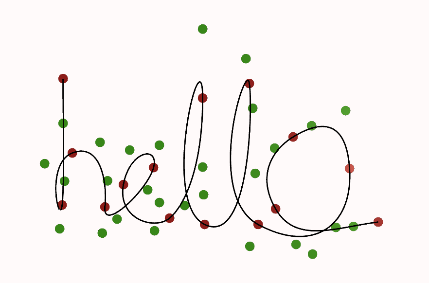

## 🌀 Interactive Bézier Curve Editor  

This project is an **interactive cubic Bézier curve editor** built **from scratch in Unity** to understand the core mathematics behind Bézier curves.  
The main goal is to explore how curves are generated, connected, and controlled using anchor and control points — by directly visualizing their geometric behavior.  

---

### ✨ Features  
- **Interactive control:** add, delete, and manipulate anchor and control points to dynamically draw smooth, connected curves  
- **Cubic Bézier segments** with **C⁰** (positional) and **C¹** (tangential) continuity between connected segments  
- **Optional closed-loop** curve generation for seamless shapes  

---

### 🖼️ Example Output  

  

<i>“hello” drawn interactively using cubic Bézier segments</i>

---

## 🎥 Demo Video  
Check out [this video](https://youtu.be/tHt4smt4QTU) to see the interactive Bézier curve editor in action!
